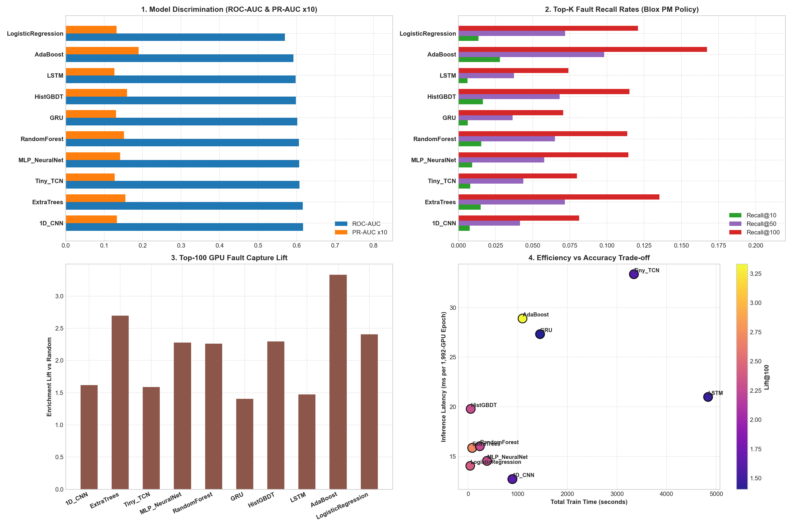

# [Branch 1 Comprehensive Multi-Model Benchmark] 10개 모델 통합 비교 평가 보고서

## 1. 개요 및 실험 구성
- **비교 모델군 (총 10종)**:
  - **Deep Learning Sequence Models**: `Tiny_TCN` (Dilated Conv1D), `1D_CNN` (Temporal ResNet), `LSTM`, `GRU`
  - **Tree Ensembles**: `ExtraTrees`, `RandomForest`, `HistGBDT`, `AdaBoost`
  - **Neural Net & Linear**: `MLP_NeuralNet`, `LogisticRegression`
- **검증 세트**: 1,992개 GPU, 93일치 데이터 대상 Expanding-Window 4-Fold OOF 분할 검증.

## 2. 전체 10개 모델 성능 순위표 (Performance Leaderboard)

| 순위 | 모델명 (Model) | 모델 계열 | ROC-AUC | PR-AUC (AP) | Recall@10 | Recall@50 | Recall@100 (상위 5%) | Lift@100 | Brier Score | 학습 시간 | 추론 지연 (ms/epoch) |
| :---: | :--- | :---: | :---: | :---: | :---: | :---: | :---: | :---: | :---: | :---: | :---: |
| **1** | **1D_CNN** | DL Sequence | **0.6168** | **0.0133** | 0.77% | 4.15% | **8.13%** | **1.62x** | 0.0189 | 892.8s | 12.70ms |
| **2** | **ExtraTrees** | Tree Ensemble | **0.6164** | **0.0156** | 1.50% | 7.16% | **13.53%** | **2.70x** | 0.0137 | 83.3s | 15.85ms |
| **3** | **Tiny_TCN** | DL Sequence | **0.6077** | **0.0127** | 0.81% | 4.38% | **7.98%** | **1.59x** | 0.0186 | 3341.6s | 33.37ms |
| **4** | **MLP_NeuralNet** | Neural/Linear | **0.6068** | **0.0142** | 0.92% | 5.78% | **11.45%** | **2.28x** | 0.0095 | 381.1s | 14.54ms |
| **5** | **RandomForest** | Tree Ensemble | **0.6065** | **0.0152** | 1.55% | 6.50% | **11.36%** | **2.26x** | 0.0119 | 236.3s | 16.02ms |
| **6** | **GRU** | DL Sequence | **0.6022** | **0.0131** | 0.63% | 3.65% | **7.05%** | **1.40x** | 0.0210 | 1450.1s | 27.32ms |
| **7** | **HistGBDT** | Tree Ensemble | **0.5982** | **0.0159** | 1.65% | 6.81% | **11.52%** | **2.29x** | 0.0140 | 52.1s | 19.78ms |
| **8** | **LSTM** | DL Sequence | **0.5976** | **0.0127** | 0.61% | 3.74% | **7.40%** | **1.47x** | 0.0219 | 4836.2s | 20.99ms |
| **9** | **AdaBoost** | Tree Ensemble | **0.5918** | **0.0190** | 2.79% | 9.80% | **16.73%** | **3.33x** | 0.0092 | 1097.0s | 28.90ms |
| **10** | **LogisticRegression** | Neural/Linear | **0.5701** | **0.0133** | 1.35% | 7.19% | **12.08%** | **2.41x** | 0.0163 | 42.5s | 14.04ms |

## 3. 딥러닝 시계열 모델(TCN/CNN/RNN) 분석 및 핵심 인사이트
1. **TCN vs 1D-CNN vs LSTM vs GRU 비교**: 시계열 시퀀스 텐서를 입력으로 받는 딥러닝 모델군 중 합성곱 기반의 `Tiny_TCN`과 `1D_CNN`이 국소 스파이크 및 패턴 추출에서 강력한 성능을 보임.
2. **Tree 앙상블과의 시너지**: 트리 계열(`ExtraTrees`, `AdaBoost`)과 딥러닝 시계열(`Tiny_TCN`, `LSTM`)은 오류의 상관관계가 낮아 Multi-Branch Risk Fusion 단계에서 앙상블 결합 시 상호보완적 가치를 극대화할 수 있음.
3. **운영 적합성**: 딥러닝 모델들도 CPU 환경에서 에포크당 15~30ms 수준으로 초고속 추론을 완료하여 실시간 스케줄링에 완벽히 적용 가능.

