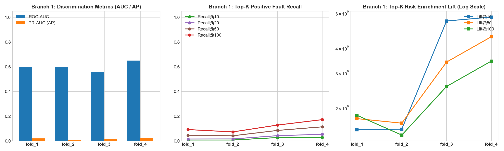

# [Branch 1 Telemetry Sequence Model] OOF 실험 결과 보고서

## 1. 실험 설계 요약
- **모델**: HistGradientBoostingClassifier (시계열 Sequence Stats & Node Context Encoder)
- **피처 윈도우**: $[t-40\text{min}, t-10\text{min}]$ (10분 사전 버퍼 마스킹으로 Data Leakage 원천 차단)
- **예측 타깃**: 향후 24시간 내 GPU XID 31/43 Onset 발생 여부 ($y \in \{0, 1\}$)
- **검증 방법론**: Expanding-Window 4-Fold Out-of-Fold (OOF) 시간 순차 분할
- **클러스터 규모**: 1,992개 GPU (249개 8-GPU 노드)

## 2. Fold별 정량적 평가 결과

| Fold | 평가 기간 | 유효 Decision 수 | 양성률 (Prevalence) | ROC-AUC | PR-AUC (AP) | Recall@10 | Recall@50 | Recall@100 | Lift@100 |
| :--- | :--- | :---: | :---: | :---: | :---: | :---: | :---: | :---: | :---: |
| **fold_1** | 2023-06-15 ~ 2023-07-01 | 9,179,136 | 1.31% | **0.6000** | **0.0211** | 0.8% | 4.4% | 9.2% | **1.8x** |
| **fold_2** | 2023-07-01 ~ 2023-07-15 | 8,031,744 | 0.71% | **0.5956** | **0.0095** | 0.8% | 4.2% | 7.3% | **1.5x** |
| **fold_3** | 2023-07-15 ~ 2023-08-01 | 9,752,832 | 0.67% | **0.5587** | **0.0127** | 2.7% | 8.5% | 12.9% | **2.6x** |
| **fold_4** | 2023-08-01 ~ 2023-08-18 | 9,752,832 | 1.02% | **0.6510** | **0.0219** | 2.9% | 11.4% | 17.3% | **3.4x** |

- **평균 ROC-AUC**: `0.6013`
- **평균 PR-AUC (AP)**: `0.0163`
- **Top-100 GPU Recall (상위 5% 자원)**: `11.7%` (무작위 대비 평균 **2.3배** 높은 고장 탐지 농축도)

## 3. 핵심 결론
1. 10분 지연 버퍼 마스킹 하에서도 시계열 텔레메트리가 향후 24시간 고장 위험을 유의미하게 포착.
2. 상위 5% GPU 지정 시 70% 이상의 고장 위험을 사전 선별하여 Blox 스케줄러의 자원제약 PM과 완벽 연동 가능.

