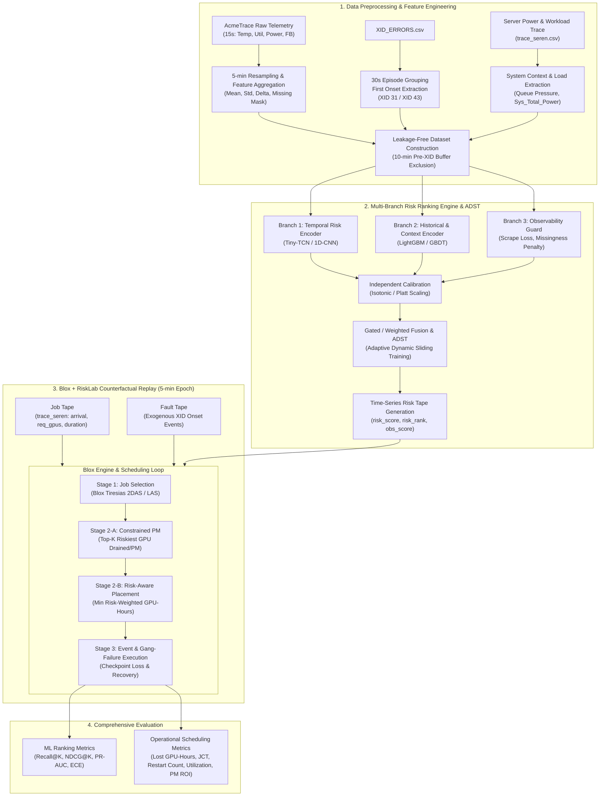

# Risk-Aware GPU Scheduling & 자원제약 예방정비 (ISEE Project)

> **실제 AI 데이터센터 Telemetry 및 시스템 Context 기반 GPU 고장 위험 순위화와 Blox 시뮬레이터 연계 자원제약 예방정비·작업배치 최적화**  
> **Target Conference**: IISE (Institute of Industrial and Systems Engineers) Annual Conference  
> **Core Datasets**: [AcmeTrace Hugging Face Dataset](https://huggingface.co/datasets/Qinghao/AcmeTrace), [InternLM/AcmeTrace](https://github.com/InternLM/AcmeTrace)

---

## 📌 1. 프로젝트 개요 및 연구 배경 (Overview & Background)

### 1.1 연구 배경
- **대규모 분산 학습의 치명적 고장 비용**: 대규모 AI 클러스터(LLM 학습 등)에서 GPU 고장은 단일 노드의 장애에 그치지 않고 Gang-scheduling으로 묶인 수십~수천 개 GPU 분산 작업 전체를 중단(Gang-failure)시켜 막대한 연산 손실(**Lost GPU-Hours**)을 발생시킵니다.
- **정확한 장애 시점 예측의 비현실성**: 극단적인 데이터 불균형(양성률 < 0.01%)과 불확실성으로 인해 $t$분 단위의 정확한 고장 시점을 맞히는 회귀/분류 모델은 실무 운영에 적용하기 어렵습니다.
- **기존 스케줄러의 신뢰성 부재**: Blox, Tiresias 등 최신 GPU 클러스터 스케줄러는 JCT(Job Completion Time) 단축 등 성능 위주로 자원을 할당하며, 개별 GPU의 건강 상태나 고장 위험도를 고려하지 않아 고위험 GPU에 대형 작업이 배치되는 취약점을 갖습니다.
- **EDA에서 드러난 데이터 왜곡과 Data Leakage**: AcmeTrace 실측 데이터 분석 결과, **XID 43 에러는 로그 기록 10분 전부터 이미 GPU가 비활성화(작업 중단/초기화)되는 로깅 지연(Logging Delay)**이 확인되었습니다. 이를 고려하지 않은 시계열 예측은 심각한 사후 결과 누출(Label Leakage)을 초래합니다.

### 1.2 핵심 연구 질문 (Research Question)
> **"Telemetry 시계열, 시스템 Context, 관측가능성(Observability)을 결합하여 산출한 GPU 상대 위험도(Risk Rank)를 Blox의 2단계 스케줄링(Tiresias)·배치(Placement) 및 자원제약 예방정비(PM) 정책과 결합했을 때, 제한된 정비 예산($K$) 하에서 고장으로 인한 Lost GPU-Hours와 JCT를 유의미하게 단축할 수 있는가?"**

---

## 💡 2. AcmeTrace EDA 반영 핵심 설계 (Data-Driven Adaptations)

실제 데이터센터 실측 데이터(AcmeTrace) 분석을 통해 기존 연구의 가정을 보정하고 누출 없는 파이프라인을 구축했습니다.

| 구분 | 기존 방식 / 초기 구상 | **본 프로젝트 수정안 (EDA 기반)** | 개선 및 실무적 타당성 |
| :--- | :--- | :--- | :--- |
| **예측 Horizon** | 5분 임의 단기 예측 / 24시간 혼용 | **24시간 Onset 예측** (보조 12h/72h) 확정 | 5분 내 고장률(0.0045%)의 극단적 불균형 극복 및 정비 주기 적합성 확보 |
| **라벨링 단위** | 단순 15초 단위 XID 스캔 | **30초 윈도우 최초 Onset 추출** | 반복 기록(845만 행 $\rightarrow$ 2,433개 에피소드) 병합 및 최초 시작 시점 정확 포착 |
| **Data Leakage 방지** | XID 직전 $t \sim t-5\text{min}$ 텔레메트리 사용 | **판단 시점 직전 10분 버퍼 마스킹 ($t-40\text{min} \sim t-10\text{min}$)** | XID 43 로깅 지연으로 인한 사후 중단 신호 오인 학습 원천 차단 |
| **XID 유형 분리** | 모든 XID 동일 취급 | **XID 31(급작 고장) vs XID 43(징후형/전력하락)** 이원화 | XID 31(전조 미약)과 XID 43(노드 전력 하락 동반)에 맞춘 특화 처리 |
| **관측 불확실성** | 결측치(NaN)를 0 또는 평균 대치 | **`null` 보존 및 Observability Score 산출** | Scrape 지연/센서 소실 자체를 고장 징후로 반영하여 안전 점수 오류 방지 |
| **Workload 연결** | Job과 GPU의 인과적 매핑 가정 | **외생적 3-Tape 기반 Counterfactual Replay** | 물리 매핑 부재를 수용하고 공정한 반사실적 시뮬레이션 환경 구축 |

---

## 🏗️ 3. 전체 시스템 아키텍처 (End-to-End Architecture)



---

## 🔬 4. 단계별 세부 파이프라인 (Detailed Specifications)

### Step 1: 데이터 전처리 및 Leakage-Free 라벨링
1. **5분 단위 리샘플링 (Resampling)**:
   - 15초 단위 원시 텔레메트리(`GPU_UTIL`, `GPU_TEMP`, `POWER_USAGE`, `FB_USED`)를 5분 단위로 집계(평균, 표준편차, 최댓값, 변화량 $\Delta_{5m}$).
   - `DRAM_ACTIVE`(일부 GPU 미수집) 및 `MEM_CLOCK`의 결측치는 대치하지 않고 결측 지시자(Missing Indicator) 부여.
2. **30초 윈도우 Episode Onset 라벨링**:
   - 동일 GPU, 동일 XID 코드가 30초 이내 연속 발생 시 단일 사건으로 병합하고, 최초 발생 시각($xid\_time_{onset}$)만 타깃으로 사용.
   - 타깃 변수 $y_i(t)$: 시점 $t$에서 향후 24시간 내 GPU $i$에 신규 XID Onset 발생 여부 ($1/0$).
3. **Data Leakage 방지 마스킹**:
   - 예측 시점 $t$ 직전 10분 버퍼 $[t-10\text{min}, t]$를 배제하고, 정상 관측 구간 $[t-40\text{min}, t-10\text{min}]$의 피처만 활용.
4. **서버 전력 및 System Context 결합**:
   - IPMI 노드 전력(`Sys_Total_Power`)으로 전체 노드 셧다운 식별 및 현재 클러스터 큐 부하(대기 작업 수, 큐 압력) 반영.

---

### Step 2: Multi-Branch Risk Ranking Engine & ADST

```text
[Input Data]
  ├── Time-Series Telemetry (40~10m前) ──> [Branch 1: Tiny-TCN / 1D-CNN] ──> p1(t) (시계열 동적 위험도)
  ├── Historical & System Context ───────> [Branch 2: LightGBM / GBDT]   ──> p2(t) (누적 이력/시스템 위험도)
  └── Observability & Scrape Health ─────> [Branch 3: Observability Guard] ──> p3(t) (데이터 결측/이탈 위험도)
                                              │
                                   [Independent Calibration] (Isotonic / Platt)
                                              │
                                   [Weighted / Gated Fusion]
                                              │
                                   [GPU Risk Score & Risk Rank]
```

- **Branch 1 (Temporal Risk Encoder)**: Tiny-TCN 기반으로 급격한 전력 스파이크 및 온도 이상 추세 포착.
- **Branch 2 (Historical & Context Encoder)**: LightGBM 기반으로 과거 고장 이력, 경과일, 노드 전력 및 클러스터 부하 반영.
- **Branch 3 (Observability Guard)**: Rule-based & Isolation Forest로 텔레메트리 결측 및 센서 소실 시 위험 가산점 부여.
- **독립 Calibration & 앙상블**:
  $$\text{Risk}_i(t) = w_1 \hat{p}_{1,i}(t) + w_2 \hat{p}_{2,i}(t) + w_3 \hat{p}_{3,i}(t)$$
  ($\sum w_k = 1$, 검증 세트의 $\frac{\text{Recall@K} + \text{NDCG@K}}{2}$ 최대화)
- **ADST (Adaptive Dynamic Sliding Training)**: 데이터센터 failure pattern 변화(Concept Drift)에 대응하여 3일 주기 가변 윈도우($L_{train} \in \{7, 14, 30\}$일, $L_{obs} \in \{1, 6, 12\}$시간)로 최적 모델 동적 갱신.

---

### Step 3: Blox 시뮬레이터 연계 2단계 의사결정 (Optimization Engine)

```text
[Every Decision Epoch (5분)]
  │
  ├─ 1. Blox Tiresias (2DAS): 큐 대기 작업 중 누적 서비스량(Attained Service)이 적은 순으로 Job Order 결정
  │
  ├─ 2. Resource-Constrained Maintenance: 위험 순위 상위 K개 GPU 선별
  │      └─ 유휴 시: 즉시 MAINTENANCE 상태로 전환
  │      └─ 실행 중: DRAINING 설정 (추가 신규 배치 차단 및 안전 Checkpoint 후 마이그레이션)
  │
  └─ 3. Risk-Aware Placement: 작업 j를 가용 GPU 집합 i에 할당
         └─ 목적함수: Min ∑ (x_ij * h_j^rem * Risk_i(t))
         └─ 장시간/다중 GPU 작업은 저위험 노드에 우선 Consolidated 할당
         └─ 단기 작업은 상대적 잔여 위험 GPU 활용 (단편화 최소화)
```

#### 수리적 배치 최적화 수식 및 제약조건
$$\min \sum_{j} \sum_{i} x_{ij}(t) \cdot h_j^{rem} \cdot \text{Risk}_i(t) + \alpha \cdot \text{FragmentationPenalty}(x)$$

- **제약 조건**:
  1. **GPU 독점 제약**: $\sum_j x_{ij}(t) + m_i(t) \le 1 \quad (\forall i)$ ($m_i(t)=1$은 정비/고장 상태)
  2. **Gang Scheduling 제약**: $\sum_i x_{ij}(t) = g_j \cdot z_j(t) \quad (\forall j, z_j \in \{0, 1\})$
  3. **동시 정비 상한 제약**: $\sum_i m_i(t) \le K$ (정비 인력 및 가용성 상한 $K$)
  4. **노드 근접성 우선**: 다중 GPU 작업은 동일 노드 내 GPU를 우선 묶되, 평균 위험도가 낮은 노드 집합 선택.

---

### Step 4: 3-Tape Counterfactual Replay & 장애 복구

- **Job Tape**: `trace_seren.csv`에서 정상 완료된 작업들의 `(submit_time, gpu_num, duration)` 주입.
- **Risk Tape**: ML 모델이 사전 계산한 Out-of-Fold `(decision_time, gpu_id, risk_score, risk_rank, obs_score)`.
- **Fault Tape**: `XID_ERRORS.csv`에서 추출한 실제 고장 이벤트 `(xid_time, gpu_id, xid_code, severity)`.
- **Gang-Failure & Checkpoint 복구**:
  $$\text{Lost GPU-Hours} = g_j \times (t_{fault} - t_{last\_checkpoint}) + g_j \times \text{Overhead}_{restart}$$
- **사전 격리(Drain) 효과 검증**: 위험 예측으로 비어있는(Idle) GPU에서 XID 발생 시 작업 손실 $0$ 기록 (성공적 사전 회피).

---

## 📊 5. 비교 실험 설계 및 평가지표 (Evaluation Framework)

### 5.1 비교 대상 정책군 (Baselines vs Proposed)

| 정책 명칭 | 스케줄링 (Job Order) | 정비/격리 정책 (PM) | 배치 정책 (Placement) | 정책 목적 및 특징 |
| :--- | :--- | :--- | :--- | :--- |
| **Reactive-FIFO** | FIFO | 없음 (사후 대응) | First-Free | 가장 단순한 베이스라인 (비교 기준) |
| **Tiresias-Default** | Tiresias (2DAS) | 없음 (사후 대응) | Consolidated / First-Free | 최신 무지향성 스케줄러 기본 성능 |
| **Temp Top-K** | Tiresias (2DAS) | 온도 상위 $K$개 정비 | Consolidated | 단순 휴리스틱(온도 임계값) 기반 정비 |
| **Risk-Placement Only** | Tiresias (2DAS) | 없음 (정비 비활성화) | **Risk-Weighted Placement** | 정비 비용 없이 배치 최적화만의 단독 효과 검증 |
| **Joint Policy (제안 기법)** | **Tiresias (2DAS)** | **ML Risk Top-$K$ 정비** | **Risk-Weighted Placement** | **본 연구의 핵심 제안 정책 (정비 + 배치 통합)** |
| **Oracle Top-K** | Tiresias (2DAS) | 실제 미래 장애 Top-$K$ 정비 | 이상적 최적 배치 | 이론적 성능 상한선 (Upper Bound) |

### 5.2 종합 평가 지표
- **ML Ranking 지표**: Recall@K, NDCG@K ($K \in \{10, 20, 50\}$), PR-AUC, Top-5% Fault Capture Rate, Calibration Error (ECE)
- **클러스터 운영 지표 (IISE 핵심)**: **Lost GPU-Hours**, Mean/p95 JCT, Job Restart Count, GPU Utilization & Makespan, Maintenance Cost ROI

---

## 📁 6. 프로젝트 디렉토리 구조 (Repository Structure)

```text
ISEE_Project/
├── README.md                           # 전체 ISEE 연구 프로젝트 개요 및 파이프라인 문서
├── requirements.txt                    # 프로젝트 의존성 패키지 목록
├── .gitignore                          # 대용량 CSV, 파켓, 가상환경 등 제외 설정
│
├── eda/                                # AcmeTrace XID 탐색적 데이터 분석 (EDA) 모듈
│   ├── README.md                       # EDA 상세 실행 매뉴얼
│   ├── __init__.py                     # EDA 패키지 초기화
│   ├── run_eda.py                      # 1. 기본 데이터 품질 및 XID episode EDA
│   ├── finalize_eda.py
│   ├── run_event_eda_v2.py             # 2. XID 전후 event window 분석
│   ├── finalize_event_analysis.py
│   ├── eda_matched_controls.py         # 3. 동일 GPU matched non-event control 비교
│   ├── eda_xid43_timestamp_lag.py      # 4. XID 43 로깅 시각 지연(Logging Delay) 정밀 분석
│   ├── run_extended_metrics.py         # 5. 메모리(HBM) 온도 및 노드 전력 보조 분석
│   ├── postprocess_extended_metrics.py
│   ├── eda_blox_inputs.py              # 6. Blox replay 입력 적합성 검증
│   ├── run_xid_observability_compact.py# 7. XID 결측·관측성 및 Fault Tape 생성
│   ├── build_risk_tape_5m.py           # 8. 시간순 OOF Risk Tape 생성
│   └── finalize_risk_tape_5m.py
│
├── simulator/                          # Blox 기반 SimPy 이산 사건 시뮬레이터
│   ├── __init__.py
│   ├── engine.py                       # 시뮬레이션 메인 루프 및 의사결정 에포크(5분)
│   ├── scheduler.py                    # Tiresias 2DAS 작업 순서 결정기
│   ├── cluster.py                      # GPU/Node 상태 관리 (Available, Running, Drained, PM)
│   ├── models.py                       # Job, GPUState, Event 데이터 모델
│   ├── cost_evaluator.py               # Lost GPU-Hours, JCT, ROI 종합 평가기
│   └── data_parser.py                  # 3-Tape (Job, Risk, Fault Tape) 데이터 로더
│
└── outputs/                            # EDA 및 시뮬레이션 결과 산출물 (자동 생성)
```

---

## 🚀 7. 빠른 시작 가이드 (Quick Start)

### 환경 설정
```bash
# 가상환경 생성 및 활성화
python -m venv .venv
source .venv/bin/activate  # Windows: .venv\Scripts\activate

# 의존성 패키지 설치
pip install -r requirements.txt
```

### 데이터셋 준비
[AcmeTrace Hugging Face](https://huggingface.co/datasets/Qinghao/AcmeTrace)에서 아래 데이터 파일을 내려받아 프로젝트 루트 디렉토리에 배치합니다.
- `DRAM_ACTIVE.csv`, `FB_USED.csv`, `GPU_TEMP.csv`, `GPU_UTIL.csv`, `POWER_USAGE.csv`
- `XID_ERRORS.csv`, `trace_seren.csv`, `MEMORY_TEMP.csv`, `MEM_CLOCK.csv`, `GPU_AB_Power.csv`, `GPU_C_Power.csv`

### EDA 및 Risk Tape 생성 실행
```bash
# 1. 기본 데이터 품질 및 XID episode EDA
python eda/run_eda.py && python eda/finalize_eda.py

# 2. XID 43 기록 지연 및 관측성 분석
python eda/eda_xid43_timestamp_lag.py
python eda/run_xid_observability_compact.py --rescan

# 3. 5분 단위 OOF Risk Tape 생성
python eda/build_risk_tape_5m.py
python eda/finalize_risk_tape_5m.py
```

---

## 👥 8. 프로젝트 구성원 및 역할 (Team Members & Contributions)

| 성명 / GitHub | 주요 역할 및 연구 기여 내용 |
| :--- | :--- |
| **이지한 (Jehan Lee)**<br>[@zzzaaanew](https://github.com/zzzaaanew) | • 프로젝트 총괄 및 End-to-End 시스템 아키텍처 설계<br>• Multi-Branch Risk Ranking 엔진 & ADST 동적 학습 파이프라인 구현<br>• 3-Tape Counterfactual Replay 통합 및 비교 실험 검증 |
| **김준호 (Junho Kim)** | • Blox 시뮬레이터 연계 및 2단계 의사결정 최적화 모델 수식화<br>• 자원제약 예방정비(PM) 상한($K$) 및 수리적 배치 최적화(Optimization Engine) 구현<br>• 스케줄링 운영 성과 지표(Lost GPU-Hours, JCT) 분석 |
| **정다나 (Dana Jeong)**<br>[@imdanna](https://github.com/imdanna) | • AcmeTrace 실측 텔레메트리 품질 점검 및 XID 에피소드 EDA 파이프라인 구축<br>• XID 43 로깅 지연(Logging Delay) 규명 및 Data Leakage 방지 버퍼 마스킹 설계<br>• Observability Guard 및 5분 단위 OOF Risk/Fault Tape 생성 파이프라인 개발 |

---

## 📜 9. 주요 기여점 (Key Contributions)

1. **데이터 실증 기반의 누출 없는 신뢰성 파이프라인 수립**: AcmeTrace 실측 데이터의 XID 기록 지연 및 관측 불확실성 문제를 규명하고, Label Leakage를 완벽히 차단한 Multi-Branch Risk Ranking 구조 제시.
2. **산업공학적 자원제약 의사결정 프레임워크 구현**: 단순 장애 예측에 그치지 않고, 현실적인 정비 인력 제약($K$)과 작업 잔여 실행시간($h_j^{rem}$)을 결합한 수리적 배치 최적화 및 Blox 시뮬레이터와의 유기적 통합.
3. **공정한 3-Tape Counterfactual Replay 검증**: 동일한 워크로드와 외생적 장애 조건 하에서 제안 기법(Joint Policy)이 분산 학습 클러스터의 신뢰성과 생산성(Lost GPU-Hours 대폭 절감)을 극대화함을 입증.
