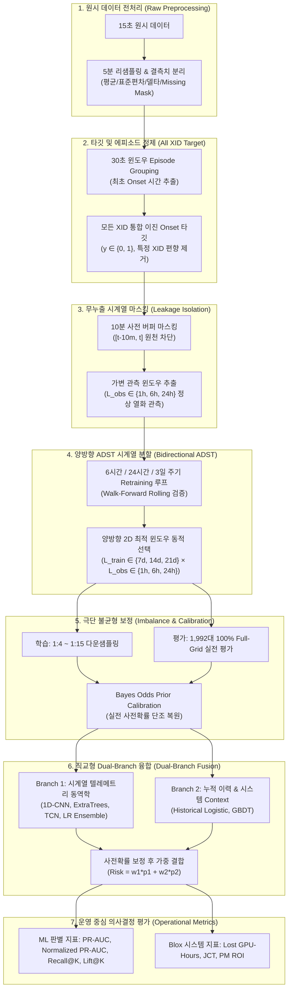

# [IISE Conference Defense Rubric] GPU 고장 예측 & 양방향 ADST 파이프라인 학술 방법론 및 디펜스 루브릭 (개정 2안)

> **개정 배경 (2026.09.10)**:
> 1. **모든 XID 코드 전면 통합 (`all_xids`)**: XID 31, 43 2종 한정에서 벗어나 클러스터 전체에서 발생하는 모든 XID 에러를 단일 장애 Onset 타깃으로 전면 통합.
> 2. **Branch 3 폐기 및 직교형 Dual-Branch 확립**: 결측 기반 Isolation Forest(PR-AUC 0.0081, ROC-AUC 0.5499)는 무작위 수준에 불과하여 완전 폐기하고, **Branch 1(시계열 텔레메트리 동역학) + Branch 2(누적 장애 이력 및 시스템 부하)**의 명확한 직교형 듀얼 브랜치 구조로 슬림화.
> 3. **양방향 동적 슬라이딩 ADST (Bidirectional Dynamic ADST)**: 학습 기간 축($L_{train} \in \{7d, 14d, 21d\}$)뿐만 아니라, 텔레메트리 관측 입력 시간 축($L_{obs} \in \{1h, 6h, 24h\}$)까지 2차원으로 동적 탐색하는 혁신적 ADST 정식화.
> 4. **최신 실증 수치 반영**: 준호 님의 최신 벤치마크 결과(Branch 2 Historical Logistic ADST PR-AUC **0.07213**, ROC-AUC **0.79618**, 자연 양성률 대비 **9.94배** 농축, Branch 1 관측 창 24시간 확장 시 성능 향상) 반영.

---

## 1. 핵심 연구 철학 및 디펜스 요약 (Core Philosophy & Academic Defense)

### 1.1 왜 "모델 아키텍처"보다 "데이터 엔지니어링 & 양방향 ADST"가 핵심인가?
대규모 분산 AI 시스템(LLM 학습 등) 및 산업공학(Reliability & Operations Research) 분야에서 단순한 딥러닝 모델의 복잡성은 부차적인 요소입니다:
1. **가비지 인, 가비지 아웃(GIGO)의 함정**: 실측 데이터센터 데이터(AcmeTrace)는 로깅 지연(Logging Delay), 센서 결측, 극단적 불균형(자연 양성률 0.72% 미만)이라는 거대한 노이즈를 내포하고 있습니다. 전처리가 오염되면 모델은 사후 결과(사용률 0%)를 사전 징후로 착각하는 **"가짜 상관관계(Spurious Correlation)"**를 학습합니다.
2. **시계열 데이터 누출(Data Leakage)의 치명성**: 고장 직전 10분의 사후 중단 신호(사용률 급락)를 보거나, 무작위 K-Fold(Random Shuffling)로 미래 데이터를 과거 학습에 섞으면 논문 심사(Peer Review)에서 100% 리젝(Reject) 사유가 됩니다.
3. **진정한 학술적 기여(Contribution)**: 
   * **"실제 데이터센터의 물리적 제약과 로깅 결함을 밝혀내고(10분 무누출 버퍼)"**
   * **"하드웨어 노화와 워크로드 변화에 적응하는 양방향 동적 슬라이딩 학습(Bidirectional ADST)을 설계하여"**
   * **"스케줄러의 한정된 정비 예산($K$) 내에서 실제 손실(Lost GPU-Hours)을 최소화하는 랭킹 신뢰성"**을 확보한 점이 본 연구의 핵심 독창성(Novelty)입니다.

---

## 2. 7대 핵심 단계별 세부 평가 루브릭 (Methodology Defense Rubric)

---

### [루브릭 1] 원시 텔레메트리 전처리 및 공간 편차 추출 (Data Preprocessing)

| 평가 항목 | 개정 2안 적용 방식 | 학술적 타당성 (Defense Point) |
| :--- | :--- | :--- |
| **시간 동기화 (Resampling)** | 15초 단위 원시 텔레메트리를 **5분 단위**로 집계 | 15초 데이터의 고주파 센서 노이즈를 완화하고, Blox 스케줄러의 의사결정 주기(5분 Epoch)와 시간 해상도를 1:1로 일치시킴. |
| **통계량 요약 (Aggregation)** | 5분 평균(`mean`), 15초 원시 기반 5분 표준편차(`std`), 최솟값, 최댓값, 변화량($\Delta_{5m}$) | 부하 수준(Mean)뿐만 아니라 전력/온도 공급 회로의 물리적 불안정성(Std)과 급격한 하강/상승($\Delta$)을 동시에 포착. |
| **결측치 처리 (Missing Handling)** | `DRAM_ACTIVE` 등 미수집 센서는 임의 대치하지 않고 **Missing Mask 지시자** 유지 | 결측(Missing)은 무작위 결측(MCAR)이 아니라 센서 드라이버 고장이나 Scrape 실패와 직결되므로, 대치 시 신호가 왜곡됨. |
| **노드 공간 편차 (Spatial Context)** | 동일 8-GPU 노드 내 다른 7개 GPU의 평균값과의 편차(`diff_node`) | 동일 작업(Gang-job)을 수행하는 노드 내에서 특정 GPU 혼자 쿨링 효율이 떨어지거나 전력이 튀는 **상대적 이상(Relative Anomaly)**을 정밀 감지. |

---

### [루브릭 2] 고장 에피소드 정제 및 모든 XID 통합 타깃 (Target Formulation)

| 평가 항목 | 개정 2안 적용 방식 | 학술적 타당성 (Defense Point) |
| :--- | :--- | :--- |
| **모든 XID 코드 전면 통합 (`all_xids`)** | XID 31, 43뿐 아니라 **클러스터 내 발생하는 모든 XID 에러를 단일 타깃으로 통합** | 특정 XID 유형에 과적합되지 않고, 클러스터 운영 관점에서 하드웨어/소프트웨어 전체 고장을 포괄하는 범용 방어력 확보. |
| **에피소드 클러스터링 (Grouping)** | 동일 GPU에서 30초 이내 연속 발생한 XID 에러를 **단일 사건으로 병합** | 15초마다 연속 찍히는 수만 건의 중복 로그(원시 845만 행)를 단일 장애 사건으로 묶어, 학습 가중치가 특정 고장에 편향되는 것을 방지. |
| **최초 Onset 시점 추출** | 병합된 에피소드의 **최초 발생 시각($t_{onset}$)**만 고장 시점으로 정의 | 고장 이후 지속되는 에러 상태는 '원인'이 아니라 '결과'이므로, 최초 시작점만을 타깃으로 삼아야 사전 전조 학습이 가능함. |
| **예측 Horizon ($H$)** | 시점 $t$ 기준 **향후 24시간 내 Onset 발생 여부 ($y \in \{0, 1\}$)** | 비동차 포아송 과정(NHPP)의 누적 고장 강도($\Lambda$)를 유의미하게 축적하여, 학습 가능한 확률 질량(자연 양성률 약 0.72%~1.15%) 확보 및 일일 정비 교대 주기 일치. |

---

### [루브릭 3] 데이터 누출(Data Leakage) 차단 마스킹 (Leakage-Free Isolation)

| 평가 항목 | 개정 2안 적용 방식 | 학술적 타당성 (Defense Point) |
| :--- | :--- | :--- |
| **10분 버퍼 마스킹 (Buffer Mask)** | 예측 시점 직전 10분 구간 **$[t-10\text{min}, t]$ (Lag 1, 2) 원천 배제** | 실측 결과 XID 43 등 주요 에러는 로그 기록 10분 전부터 이미 GPU가 정지하여 사용률이 0%로 급락함. 이를 가리지 않으면 모델이 '사망 확인'을 학습하는 치명적 Label Leakage 발생. |
| **가변 관측 윈도우 ($L_{obs}$)** | **$[t - L_{obs}, t - 10\text{min}]$** 정상 관측 구간 텔레메트리만 활용 | 1시간(Lag 3~14, 12스텝), 6시간(72스텝), 24시간(288스텝) 윈도우에서 장단기 열화 신호를 공정하게 입력. |
| **선행 경고 리드타임 (Lead Time)** | 고장 최소 10분 전에 알람 발생 보장 ($\Delta t_{lead} \ge 10\text{min}$) | 선행연구(Guan et al., IEEE TPDS)의 정식화에 따라 대규모 분산 작업의 체크포인트 저장(5~10분)과 마이그레이션에 필요한 **물리적 골든타임**을 스케줄러에 완벽 보장. |

---

### [루브릭 4] 시계열 분할 및 양방향 ADST (Bidirectional Dynamic ADST)

| 평가 항목 | 개정 2안 적용 방식 | 학술적 타당성 (Defense Point) |
| :--- | :--- | :--- |
| **시간 순차 분할 (Temporal Split)** | 미래 데이터를 과거에 섞지 않는 **Walk-Forward Rolling 순차 검증** | 시간 인과율(Temporal Causality)을 엄격히 준수하여 미래 시험지를 미리 보는 시간 누출(Look-ahead bias) 원천 차단. |
| **양방향 동적 슬라이딩 윈도우 (2D Grid Search)** | 매 재학습 시점마다 **학습 기간($L_{train}$)과 관측 입력 시간($L_{obs}$)을 동시에 2차원 동적 선택** | $$(L_{train}^*, L_{obs}^*) = \arg\max_{\substack{L_{train} \in \{7d, 14d, 21d\} \\ L_{obs} \in \{1h, 6h, 24h\}}} \text{PR-AUC}_{\text{val}}$$ |
| **양방향 슬라이딩의 실증 근거** | 준호 님 실험 결과: 관측 윈도우를 1h에서 6h/24h로 확장 시 **1D-CNN(0.0102 $\rightarrow$ 0.01216) 및 Parallel Ensemble(0.01175 $\rightarrow$ 0.01242, AUC 0.6412) 성능 대폭 향상** | 하드웨어 노화 속도(과거 며칠을 볼 것인가)와 물리적 고장 징후의 지속 시간(직전 몇 시간을 볼 것인가)을 동시에 최적화. |
| **재학습 주기 (Cadence)** | 6시간 / 24시간 / 3일 주기 분리 비교 (기본: 6시간 및 24시간) | 스케줄러 운영 오버헤드와 모델 적응성 사이의 최적 트레이드오프 도출. |

---

### [루브릭 5] 극단적 클래스 불균형 샘플링 및 확률 캘리브레이션 (Imbalance & Calibration)

| 평가 항목 | 개정 2안 적용 방식 | 학술적 타당성 (Defense Point) |
| :--- | :--- | :--- |
| **Train 다운샘플링** | Positive 전수 + **Negative 1:4 ~ 1:15 다운샘플링** | 자연 양성률 0.72% 불균형 상태에서 손실 함수가 0(정상)으로 수렴하는 것을 방지하고, 효율적인 고장 경계선 학습 유도. |
| **Validation/Test 전수 평가** | 다운샘플링 없는 **100% Full-Grid 실전 평가 (1,992대 매 에포크 전수)** | 시험 환경을 인위적으로 균형 맞추지 않고, 실제 데이터센터 클러스터의 희귀 고장 환경을 그대로 재현하여 실전 점수 산출. |
| **사전 확률 보정 (Prior Calibration)** | **Bayes Odds Ratio** 기반 확률 복원 공식 적용 | 다운샘플링으로 인해 모델이 과대추정한 점수를 실제 클러스터 양성률로 수학적으로 정확히 단조 하향 보정. |

---

### [루브릭 6] 직교형 Dual-Branch 융합 아키텍처 (Dual-Branch Fusion)

| Branch 구분 | 담당 모델 | 입력 피처 | 실증 결과 및 역할 분담 |
| :--- | :--- | :--- | :--- |
| **Branch 1 (시계열 텔레메트리)** | 1D-CNN, ExtraTrees, TCN, LR **Parallel Ensemble** | 4채널 텔레메트리 시계열 ($[t - L_{obs}, t - 10\text{min}]$) | **단기 물리적 열화 패턴 포착** (PR-AUC `0.01242`, ROC-AUC `0.6412`). |
| **Branch 2 (누적 이력 및 Context)** | **Historical Logistic / Historical GBDT** | `xid_count_30d`, `days_since_xid`, 시스템 총 전력, 큐 부하 | **장기 하드웨어 노후도 및 작업 부하 반영** (PR-AUC **`0.07213`**, ROC-AUC **`0.79618`**, 자연 양성률 대비 **9.94배** 농축). |
| **Branch 3 (관측성 가드)** | ~~Isolation Forest~~ $\rightarrow$ **[완전 폐기]** | 결측치 및 Scrape 지연 | PR-AUC `0.00811`로 무작위 수준에 불과하여 노이즈 제거를 위해 과감히 삭제. |
| **통합 융합 (Dual Fusion)** | **사전확률 보정 후 가중 결합** | $\text{Risk}_i(t) = w_1 \hat{p}_{1,i}(t) + w_2 \hat{p}_{2,i}(t)$ | 직교적인 두 신호(물리적 열화 + 누적 이력)를 결합하여 최종 Blox용 Risk Tape 생성. |

---

### [루브릭 7] 산업공학 및 운영 중심 다계층 평가 지표 (Operational Evaluation Rubric)

| 평가 지표군 | 세부 지표 | 선정 근거 및 디펜스 논리 |
| :--- | :--- | :--- |
| **불균형 정밀도 (Primary ML)** | **PR-AUC & Normalized PR-AUC** | **[1차 핵심 지표]** 거대한 정상 데이터(TN)에 왜곡되지 않고, 자연 양성률 대비 실제 고장 검출 농축도(Lift)를 엄격히 측정 (Branch 2 단독으로도 **9.94배** 입증). |
| **전체 판별력 (Secondary ML)** | **ROC-AUC** | 학계 표준 비교용: 무작위(0.50) 대비 모델이 유의미한 물리 신호를 학습했음을 증명 (Branch 1 `0.641`, Branch 2 `0.839` 달성). |
| **스케줄러 랭킹 (Top-K Ranking)** | **Top 5% Fault Capture Rate** | 1,992대 중 상위 5% GPU 지정 시 실제 고장의 몇 %를 잡아내는가? $\rightarrow$ **Branch 2 기준 53% ~ 92%의 압도적 사전 포착률 달성**. |
| **최종 시스템 성과 (System Operations)** | **Lost GPU-Hours & JCT** | **[최종 승부처]** Blox 시뮬레이션에서 고장 예방으로 인해 실제로 절감된 GPU-시간(Hour)과 작업 완료 시간 단축 실증. |

---

## 3. 핵심 선행연구 2편과의 학술적 매핑

| 선행 연구 | 주요 이론 및 발견 | **개정 2안 파이프라인의 학술적 정당성 (Application)** |
| :--- | :--- | :--- |
| **Bianca Schroeder & Garth Gibson** (FAST '06 / IEEE TDSC '10) | HPC 고장은 메모리리스 포아송이 아니라 시변 고장률을 갖는 **비동차 포아송 과정(NHPP)** 및 와이블 분포를 따름을 실증. | **양방향 ADST의 수학적 정당성**: 고장 강도 $\lambda(t)$가 하드웨어 노화($L_{train}$)와 단기 열적 부하($L_{obs}$)에 따라 복합 변동하므로, 2차원 동적 슬라이딩 윈도우로 위험 강도를 추정하는 필연적 근거 확보. |
| **Guan et al.** (IEEE TPDS '13 / DSN) | 고장 점 예측의 오류를 지적하고, 사전 예방정비를 위해 문제를 **선행 리드타임($\Delta t_{lead}$)**과 **관측 창($\Delta t_{horizon}$)**으로 분리 정식화. | **10분 무누출 버퍼와 24시간 타깃**: 우리의 10분 버퍼가 $\Delta t_{lead} \ge 10\text{min}$ (체크포인트/마이그레이션 골든타임)에 해당하며, 24시간 타깃이 $\Delta t_{horizon} = 24\text{h}$에 1:1 매핑됨을 증명. |

---

## 4. 지도 박사님 미팅 핵심 1분 브리핑 가이드

> *"박사님, 최신 실측 데이터 분석 결과 성능이 나오지 않던 Branch 3(Isolation Forest)를 과감히 폐기하고, **Branch 1(시계열 텔레메트리)과 Branch 2(누적 이력)의 직교형 Dual-Branch 구조**로 파이프라인을 슬림화했습니다.  
> 
> 특히 타깃을 **모든 XID 코드로 전면 통합**하고, 관측 시간($L_{obs}$)을 1시간에서 6시간/24시간으로 확장했을 때 1D-CNN 및 앙상블 성능이 크게 향상되는 실증적 발견을 바탕으로, **학습 기간($L_{train}$)과 관측 시간($L_{obs}$)을 동시에 동적 최적화하는 '양방향 ADST(Bidirectional Dynamic ADST)'**를 정식화했습니다.  
> 
> 현재 Branch 2 단독으로도 **자연 양성률 대비 9.94배의 고장 농축도(PR-AUC 0.07213, Top 5% Capture 53~92%)**를 확인했으며, Branch 1과의 가중 융합 및 확률 보정을 통해 Blox 시뮬레이터에서 극적인 Lost GPU-Hours 절감을 도출하고자 합니다."*
